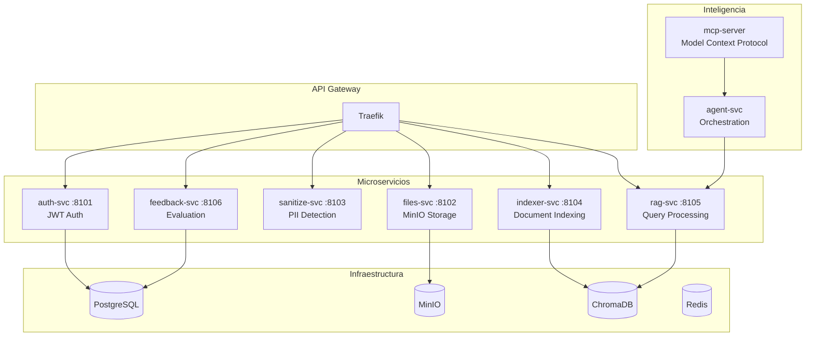

# Sistema RAG Empresarial - Arquitectura de Microservicios

[](https://www.python.org/)
[](https://fastapi.tiangolo.com/)
[ en el Master Universitario en Ingenieria de Software y Sistemas Informaticos de la Universidad Internacional de La Rioja (UNIR).

**Autor**: Jonathan Lema  
**Fecha**: Septiembre 2025  
**Programa**: Master en Ingenieria de Software y Sistemas Informaticos - UNIR  
**Institucion**: Universidad Internacional de La Rioja (UNIR)

Este trabajo representa la implementacion practica de conceptos avanzados en arquitectura de software, inteligencia artificial y sistemas distribuidos, aplicados a un caso de uso empresarial real.vg)](https://www.docker.com/)

Sistema de Recuperacion Augmentada Generativa (RAG) empresarial con arquitectura de microservicios, guardrails de privacidad PII, y orquestacion inteligente.

## Tabla de Contenidos

- [Caracteristicas](#caracteristicas)
- [Arquitectura](#arquitectura)
- [Inicio Rapido](#inicio-rapido)
- [Servicios](#servicios)
- [Instalacion](#instalacion)
- [Uso](#uso)
- [Testing](#testing)
- [Contribucion](#contribucion)

## Caracteristicas

### Seguridad y Privacidad
- **Guardrails PII**: Deteccion y sanitizacion automatica de datos personales usando Microsoft Presidio
- **Autenticacion JWT**: Sistema de roles jerarquicos (admin, moderator, user)
- **Encriptacion**: Comunicacion segura entre servicios

### Arquitectura Empresarial
- **Microservicios desacoplados**: 6 servicios independientes con responsabilidades claras
- **API Gateway**: Traefik como punto de entrada unico
- **Orquestacion**: Agent-svc + MCP-server para coordinacion inteligente
- **Escalabilidad**: Diseno preparado para Kubernetes/Docker Swarm

### Tecnologias Avanzadas
- **Vector Search**: ChromaDB para busqueda semantica eficiente
- **Embeddings**: Modelos E5 multilingue para representaciones vectoriales
- **LLM Integration**: OpenAI GPT-4o-mini con fallback local
- **Storage**: MinIO S3-compatible + PostgreSQL para persistencia

### Funcionalidades RAG
- **Retrieval Augmentation**: Busqueda hibrida (semantica + BM25)
- **Context Window Management**: Optimizacion automatica del contexto
- **Citation Tracking**: Referencias precisas a fuentes originales
- **Feedback Loop**: Sistema de evaluacion y mejora continua

## Arquitectura



### Flujo de Trabajo

1. **Upload**: Documentos subidos via files-svc → MinIO
2. **Sanitize**: Deteccion PII con Presidio → Texto limpio
3. **Index**: Chunking + embeddings E5 → ChromaDB
4. **Query**: Retrieval semantico + LLM → Respuesta contextual
5. **Feedback**: Evaluacion de calidad → Mejora continua

## Inicio Rapido

### Prerrequisitos

- **Python 3.11+**
- **Docker & Docker Compose**
- **Git**
- **4GB RAM minimo** (recomendado 8GB+)

### Instalacion Automatica

```bash
# Clonar repositorio
git clone https://github.com/tu-usuario/agentic-rag-mvp.git
cd agentic-rag-mvp

# Configurar entorno
cp .env.example .env
# Editar .env con tus claves API

# Levantar infraestructura
docker-compose up -d

# Instalar dependencias y levantar servicios
./scripts/setup-all-services.sh
```

### Verificacion

```bash
# Verificar servicios
curl http://localhost:8101/health  # auth-svc
curl http://localhost:8102/health  # files-svc
curl http://localhost:8103/health  # sanitize-svc
curl http://localhost:8104/health  # indexer-svc
curl http://localhost:8105/health  # rag-svc
curl http://localhost:8106/health  # feedback-svc
```

## Servicios

| Puerto | Servicio | Descripcion | Tecnologias |
|--------|----------|-------------|-------------|
| **8101** | `auth-svc` | Autenticacion JWT con roles | FastAPI, Jose, PostgreSQL |
| **8102** | `files-svc` | Gestion de archivos | FastAPI, MinIO, Boto3 |
| **8103** | `sanitize-svc` | Deteccion PII | FastAPI, Microsoft Presidio, SpaCy |
| **8104** | `indexer-svc` | Indexacion de documentos | FastAPI, ChromaDB, SentenceTransformers |
| **8105** | `rag-svc` | Consultas RAG | FastAPI, OpenAI, ChromaDB |
| **8106** | `feedback-svc` | Recoleccion de feedback | FastAPI, PostgreSQL, SQLAlchemy |

## Instalacion

### 1. Clonar y Configurar

```bash
git clone https://github.com/tu-usuario/agentic-rag-mvp.git
cd agentic-rag-mvp

# Configurar variables de entorno
cp .env.example .env
nano .env  # Configurar OPENAI_API_KEY, DB credentials, etc.
```

### 2. Infraestructura Docker

```bash
# Levantar servicios base
docker-compose up -d postgres minio chroma redis

# Verificar que esten corriendo
docker ps
```

### 3. Servicios Python

```bash
# Instalar dependencias para cada servicio
cd services/auth-svc && pip install -r requirements.txt
cd ../files-svc && pip install -r requirements.txt
cd ../sanitize-svc && pip install -r requirements.txt
cd ../indexer-svc && pip install -r requirements.txt
cd ../rag-svc && pip install -r requirements.txt
cd ../feedback-svc && pip install -r requirements.txt

# Levantar servicios (en terminales separadas)
uvicorn services.auth-svc.app.main:app --reload --port 8101
uvicorn services.files-svc.app.main:app --reload --port 8102
# ... continuar con los demas
```

### 4. Verificacion Completa

```bash
# Script de verificacion
./scripts/health-check.sh
```

## Uso

### Autenticacion

```bash
# Obtener token JWT
curl -X POST "http://localhost:8101/auth/login" \
  -H "Content-Type: application/json" \
  -d '{"username": "admin", "password": "admin123"}'
```

### Subir Documento

```bash
# Subir archivo con autenticacion
curl -X POST "http://localhost:8102/files/upload" \
  -H "Authorization: Bearer YOUR_JWT_TOKEN" \
  -F "file=@document.pdf"
```

### Consultar RAG

```bash
# Realizar consulta
curl -X POST "http://localhost:8105/rag/query" \
  -H "Authorization: Bearer YOUR_JWT_TOKEN" \
  -H "Content-Type: application/json" \
  -d '{
    "question": "¿Como funciona el sistema RAG?",
    "top_k": 4,
    "sanitize_in": true,
    "sanitize_out": true
  }'
```

### Respuesta de Ejemplo

```json
{
  "answer": "El sistema RAG funciona mediante recuperacion de informacion relevante...",
  "citations": [
    {
      "rank": 1,
      "id": "doc1__0",
      "score": 0.87,
      "source": "manual-rag.pdf",
      "chunk_index": 0,
      "preview": "El sistema RAG combina tecnicas de recuperacion..."
    }
  ],
  "question_sanitized": "¿Como funciona el sistema RAG?",
  "latency_ms": 1250
}
```

## Testing

### Tests Unitarios

```bash
# Ejecutar tests para todos los servicios
pytest services/*/tests/

# Tests especificos
pytest services/auth-svc/tests/test_auth.py -v
pytest services/rag-svc/tests/test_rag.py -v
```

### Tests de Integracion

```bash
# Tests end-to-end
./scripts/test-integration.sh

# Tests de carga
./scripts/load-test.sh
```

### Evaluacion RAG

```bash
# Usando RAGAS para evaluacion automatica
python -m ragas.evaluate \
  --dataset test_dataset.json \
  --metrics answer_relevancy context_relevancy faithfulness
```

## Contribucion

Las contribuciones son bienvenidas. Por favor, lee nuestras guias de contribucion (CONTRIBUTING.md).

### Desarrollo Local

1. **Fork** el proyecto
2. **Crea** una rama para tu feature (`git checkout -b feature/AmazingFeature`)
3. **Commit** tus cambios (`git commit -m 'Add some AmazingFeature'`)
4. **Push** a la rama (`git push origin feature/AmazingFeature`)
5. **Abre** un Pull Request

### Estándares de Codigo

- **Python**: PEP 8 con Black para formateo
- **Commits**: Conventional Commits
- **Tests**: Cobertura minima del 80%
- **Documentacion**: Docstrings completos

---

## � **Trabajo Fin de Máster - UNIR**

Este proyecto ha sido desarrollado como parte del **Trabajo Fin de Máster (TFM)** en el **Máster Universitario en Inteligencia Artificial** de la **Universidad Internacional de La Rioja (UNIR)**.

**Autor**: Jonathan Lema  
**Fecha**: Septiembre 2025  
**Programa**: Máster en Ingeniería de Software y Sistemas informáticos - UNIR

<div align="center">
  
</div>
